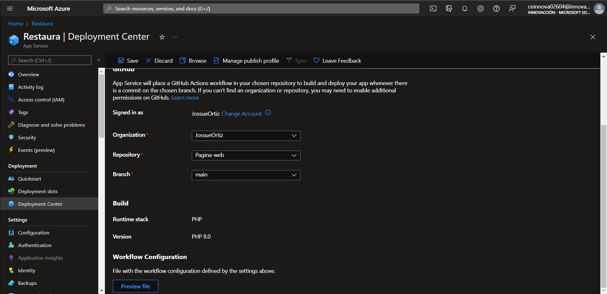

## En este apartado se vera el uso y creacion de una una App Service

Un App service se ocupa para todo pagina web que se desee crear
- Primero debemos entrar a la pagina de [Portal azure](https://portal.azure.com/#home) y buscaremos App Service

y le daremos en crear
- Llenaremos el formulario de azure donde escogeremos en el apartado de pila de entorno la opcion de PHP 8.0 y un lugar cerca (Central US)
Escogeremos en el apartado de tamaño la opcion que sea gratis:

Y creamos.
Una vez creado nos iremos al recurso y al apartado de centro de implementacion

Dentro del centro de implementacion escojeremos la opcion de HitGub e iniciamos sesion para vincular la cuenta:

Despues de autorizar debemos ingresar los datos que nos piden como el usuario, el repositorio en donde tienen el archivo que desean subir, muy importante escojer la rama main y agregar un flujo de trabajo y guardamos.

- Esperamos a que se termine de compilar y listo
**Ya tenemos nuestra pagina web**
